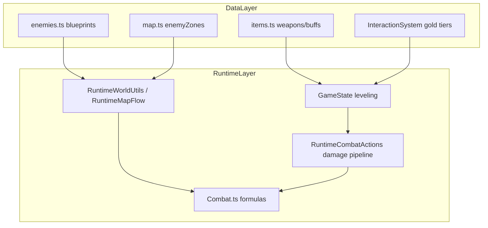

# Ortho World Builder — Comprehensive Balance Audit

Read-only audit of combat pacing, enemy curves, poise/stagger, economy, encounters, and boss tuning. Evidence cites source files and line ranges. **Updated May 2026** after P0 combat tuning, P1 survivability pass, and Whispering Woods placement fixes.

Complements:

- [WHISPERING_WOODS_DEEP_DIVE.md](./WHISPERING_WOODS_DEEP_DIVE.md) — level-design and pacing critique for the first real zone
- [AUDIT_FINDINGS.md](./AUDIT_FINDINGS.md) — broader codebase audit (A10 flags early-enemy combat readability as **partial**)

---

## Table of Contents

1. [Executive Summary](#1-executive-summary)
2. [Audit Methodology](#2-audit-methodology)
3. [Player Combat Audit](#3-player-combat-audit)
4. [Enemy Stat Audit](#4-enemy-stat-audit)
5. [Combat Formula Audit](#5-combat-formula-audit)
6. [Encounter & Pacing Audit](#6-encounter--pacing-audit)
7. [Economy Audit](#7-economy-audit)
8. [Boss Audit](#8-boss-audit)
9. [Prioritized Recommendations](#9-prioritized-recommendations)
10. [Appendix: Hit-Count Reference Tables](#10-appendix-hit-count-reference-tables)
11. [Validation Checklist](#11-validation-checklist)

---

## 1. Executive Summary

Ortho World Builder targets a Souls/Bloodborne combat loop: telegraphed attacks, poise/stagger, parry windows, bonfire essence leveling, and death penalties. The **systems exist** and **P0–P1 tuning is now applied**: entry trash TTK, player attack cadence, survivability pressure, and major Whispering Woods placement spikes are addressed.

### Three biggest balance gaps (updated)

| # | Gap | Status | Player feel |
|---|-----|--------|-------------|
| 1 | **TTK too short on entry trash** | **Fixed (P0)** — wolf 85 HP, spider 70, slime 60; combo finisher 1.2× | 4–5 hit exchanges on south-spine trash |
| 2 | **Poise system underused** | **Improved (P0)** — poise aligned with HP on entry mobs | Stagger windows matter on wolf/skeleton |
| 3 | **Pacing spikes in Whispering Woods** | **Mostly fixed** — river guard, Sentinels, Reaver flats, Forest Clearing, east void POIs | Less unfair density; Reaver range clamped |

### Secondary gaps (remaining / partially addressed)

- **Central balance config** — **`src/data/balance.ts` added** (survivability targets, stagger multipliers)
- **Reward dilution** — forest chest gold reduced 40→28; default 20→15 (**P2 partial**)
- **Early power spikes** — Ornamental Broadsword 26→**22** dmg (**P2 partial**)
- **Generous healing** — Ephemeral Extract 100→**55** HP (**P2 partial**)
- **Balance regression tests** — **`CombatBalance.test.ts` added** (P3 partial)

### Verdict

The game has the **right architecture** for Souls-like combat (telegraph states, poise, parry, phases, bonfire loop). The **primary fix surface** is entry-trash HP/poise alignment plus attack cadence — not adding new systems. See [§9 Prioritized Recommendations](#9-prioritized-recommendations).

---

## 2. Audit Methodology

### Baseline assumptions

All hit-count and TTK math in this document uses:

| Assumption | Value | Source |
|------------|-------|--------|
| Player level | 1 | `GameState.ts:279` |
| Strength | 1 | `GameState.ts:282` |
| Equipped weapon | Meek Short Sword (20 dmg, 2.0 range) | `items.ts:94-104`, `GameState.ts:246-247` |
| Buffs / rings | None | — |
| Attack type | Light attacks unless noted | `RuntimeCombatActions.ts` |
| Combo damage | 20 / 20 / 28 (steps 0→1→2) | `setupGameRuntime.ts:411` |
| Crit multipliers | Off (no backstab, recover, or stagger) | `Combat.ts:1619-1631` |
| Design benchmark | **3–4 R1-equivalent hits** on entry trash | Dark Souls early hollow cadence |
| Essence default | `floor(hp / 2)` unless blueprint override | `Combat.ts:501` |

**Damage timing:** Player damage applies at **swing start** (`RuntimeCombatActions.ts:455` inside `_executeAttackStep`), not at animation end. TTK estimates use this.

### Balance data flow



### Scope

| Region / map | Audit depth |
|--------------|-------------|
| Whispering Woods (`forest`) | **Primary** — ~199 zone spawns + runtime bosses |
| Greenleaf (`village`) | Secondary — tutorial-adjacent, low density |
| Ruins (`ruins`) | Secondary — endgame density, Ashen Reaver |
| Interior arenas | Boss-only spawns via `RuntimeMapFlow.ts` |

---

## 3. Player Combat Audit

### 3.1 Default player stats

Source: `src/lib/game/GameState.ts:240-285`

| Stat | Value |
|------|------:|
| Health / maxHealth | 100 |
| Stamina / maxStamina | 120 |
| Attack damage | 20 (weapon-driven) |
| Attack range | 2.0 |
| Walk / sprint speed | 0.0605 / 0.11 |
| Stamina regen | 44/s (after 0.38s delay) |
| Dodge duration / cooldown | 0.25s / 600ms |
| Dodge i-frames | 0.22s (`setupGameRuntime.ts:435`) |
| Attack cooldown | 500ms (`GameState.ts:249`) |
| Level / vitality / endurance / strength | 1 / 1 / 1 / 1 |

### 3.2 Leveling formulas

Source: `GameState.ts:542-565`

| Stat | Per point | Formula |
|------|-----------|---------|
| Vitality | +20 max HP | `maxHealth = 100 + (vitality - 1) × 20` |
| Endurance | +15 max stamina | `maxStamina = 120 + (endurance - 1) × 15` |
| Strength | +3 damage | `attackDamage = weaponBase + (strength - 1) × 3` |

**Level-up cost:** `floor(80 + (level - 1) × 40 + (level - 1)^1.8 × 12)` (`GameState.ts:542-543`)

| Target level | Cost (essence) |
|-------------|---------------:|
| 1 → 2 | 80 |
| 2 → 3 | 132 |
| 3 → 4 | 202 |
| 4 → 5 | 278 |
| 5 → 6 | 359 |

Each level-up fully restores HP and stamina.

### 3.3 Attack pacing constants

Source: `src/game/runtime/setupGameRuntime.ts:406-435`

| Constant | Value |
|----------|------:|
| `ATTACK_FRAME_DURATION` | 0.10s |
| `COMBO_FRAME_MULTIPLIERS` | [1.0, 0.85, 0.72] |
| `COMBO_DAMAGE_MULTIPLIERS` | [1.0, 1.0, 1.4] |
| `COMBO_WINDOW_DURATION` | 0.30s |
| `CHARGE_TIME_MIN` / `MAX` | 0.4 / 1.2s |
| `CHARGE_DAMAGE_MULT` | 2.5 |
| `ATTACK_STAMINA_COST` | 15 |
| `CHARGE_ATTACK_STAMINA_COST` | 32 |
| `BLOCK_STAMINA_COST` | 1.5 per frame |
| `DODGE_IFRAME_DURATION` | 0.22s |
| Dodge stamina cost | 26 (wired in runtime) |

**Derived swing lengths** (3 anim frames per step):

| Combo step | Swing duration |
|-----------|---------------:|
| 0 | 0.30s |
| 1 | 0.255s |
| 2 | 0.216s |
| Full chain | 0.771s |

### 3.4 Recovery lockout

Source: `PlayerSimulationSystem.ts:830-834`

| Event | `attackRecoveryTimer` |
|-------|----------------------:|
| After step 0 or 1 | 0.20s |
| After finisher (step 2) | 0.32s |

Combo chains **bypass** recovery between steps. Isolated R1s: ~0.50s per hit (0.30s swing + 0.20s recovery), plus 500ms attack cooldown if not chaining.

**Player hurt lockout:** 0.35s on unblocked hit (`Combat.ts:1528-1529`, `1091-1092`).

### 3.5 Damage pipeline

Source: `RuntimeCombatActions.ts:389-406`, `Combat.ts:1583-1654`

```
baseDamage = floor(attackDamage × parryBonus × comboStepMult × berserkerMult)
```

| Modifier | Multiplier | Applied in |
|----------|-----------|------------|
| Parry follow-up | ×1.25 | `RuntimeCombatActions.ts:389` |
| Combo finisher (step 2) | ×1.4 | `setupGameRuntime.ts:411` |
| Berserker Draught | ×1.5 dmg | `items.ts:155`, player state |
| Backstab (idle, behind) | ×2.5 | `Combat.ts:1621` |
| Hit during enemy recover | ×1.5 | `Combat.ts:1626` |
| Hit while enemy staggered | ×2.0 | `Combat.ts:1630` |
| Full charge (Meek sword) | ×2.5 → 50 dmg | `setupGameRuntime.ts:417` |

**Known desync:** Floating damage text in `RuntimeCombatActions.ts:401-404` recomputes crit/backstab multipliers for display. Actual HP/poise changes happen in `Combat.playerAttack`. Future tuning should keep these in sync.

### 3.6 TTK vs Souls-like target

| Metric | Current | Souls-like target | Gap |
|--------|---------|-------------------|-----|
| Wolf TTK (2× isolated R1) | ~0.50s | ~2–3s exchange | Too fast |
| Wolf TTK (combo steps 0+1) | ~0.30s | — | Faster than 2 R1s |
| Full combo damage | 68 | Should not delete ≤60 HP trash in one chain | One combo kills shadow (60 HP) |
| Stamina per full combo | 45 / 120 (37.5%) | ~60–70% before forced backoff | Stamina rarely gates early clears |
| Charge full (Meek, 50 dmg) | ~0.36s AOE | Tradeoff kill, slower than R1 loop | Deletes all entry trash instantly |

### 3.7 Stamina economy

| Action | Cost | From full bar (120) |
|--------|-----:|--------------------|
| Light attack | 15 | 8 swings |
| Full 3-hit combo | 45 | 2 combos + 2 extra hits |
| Charge / spin / lunge | 32 | 3 charges (96 stamina) |
| Dodge | 26 | 4 dodges |
| Sprint | 16/s | — |

**Regen:** 44/s base → ~2.7s to refill from empty after 0.38s delay. Gravebound Ring: ×1.22 regen (`items.ts:201-203`).

Tempest Grass fully refills stamina plus 35 HP (`items.ts:13-19`).

### 3.8 Weapon breakpoint table (hits to kill, light attacks only)

Formula: `attackDamage = weaponBase + (strength - 1) × 3`

| Enemy HP | Meek 20 | Broad 26 | Iron 28 | Shadow 36 | Terminus 40 | Crystal 44 |
|---------:|--------:|---------:|--------:|----------:|------------:|-----------:|
| 25 (slime) | 2 | **1** | **1** | **1** | **1** | **1** |
| 35 (spider) | 2 | 2 | 2 | **1** | **1** | **1** |
| 40 (wolf) | 2 | 2 | 2 | 2 | **1** | **1** |
| 45 (bandit) | 3 | **2** | **2** | **2** | **1** | **1** |
| 50 (plant) | 3 | **2** | **2** | **2** | 2 | **1** |
| 55 (skeleton) | 3 | **2** | **2** | **2** | 2 | 2 |
| 60 (shadow) | 3 | 3 | 3 | **2** | **2** | **2** |
| 80 (armored wolf) | 4 | 3 | 3 | 3 | **2** | **2** |

**Notable cliffs:**

- Ornamental Broadsword (26): slime 2→1 hit; bandit/plant/skeleton 3→2
- Terminus Scythe (40): wolf 2→1 hit
- Strength 8 on Meek sword (+21 dmg → 41 total): one-shots wolf

**Full combo totals:** Meek 68 | Broad 88 | Iron 94 | Shadow 122 | Terminus 136 | Crystal 150

---

## 4. Enemy Stat Audit

### 4.1 Full enemy tier table

Source: `src/data/enemies.ts`

Essence column shows blueprint value; blank = defaults to `floor(hp/2)` at spawn.

| Tier | Type | Name | HP | Dmg | Poise | Stagger | Telegraph | Recover | Essence | Behavior flags | Regions |
|------|------|------|---:|----:|------:|--------:|----------:|--------:|--------:|----------------|---------|
| Fodder | slime | Green Slime | 25 | 5 | 40 | 1.0 | 1.2 | 0.8 | 12 | — | WW, Greenleaf, Ruins |
| Fodder | spider | Giant Spider | 35 | 8 | 30 | 1.8 | 0.4 | 0.3 | 17 | ranged 50% @ 3 tiles | WW |
| Trash | wolf | Forest Wolf | 40 | 10 | 60 | 1.2 | 0.5 | 0.4 | 20 | chain 60%, retreat | WW, Greenleaf, Ruins |
| Trash | bandit | Bandit | 45 | 11 | 50 | 1.5 | 0.7 | 0.5 | 22 | — | Greenleaf only |
| Trash | plant | Vine Terror | 50 | 12 | 120 | 0.8 | 1.0 | 1.0 | 25 | snare on hit | WW, Ruins |
| Trash | skeleton | Skeleton Warrior | 55 | 14 | 70 | 1.4 | 0.9 | 0.7 | 27 | — | WW, Ruins |
| Mid | shadow | Shadow Reaper | 60 | 15 | 80 | 1.0 | 0.6 | 0.5 | 30 | chain 30% | WW, Ruins |
| Mid | void_wisp | Void Wisp | 80 | 18 | 60 | 0.8 | 0.5 | 0.45 | 45 | chain 40% | **Unplaced** |
| Mid | armored_wolf | Armored Wolf | 80 | 18 | 100 | 0.9 | 0.6 | 0.5 | 25 | poise immunity 1st | WW, Ruins |
| Elite | hollow_reaver | Hollow Reaver | 95 | 14* | 60 | 1.2 | 0.9 | 0.7 | 65 | proj scythe 7 t/s, 1.6s life | WW, Ruins (arena adds) |
| Elite | skeleton_captain | Skeleton Captain | 110 | 20 | 120 | 1.2 | 0.85 | 0.65 | 40 | poise immunity 1st | WW, Ruins |
| Elite | shadow_lurker | Hollow Shade | 110 | 18 | 90 | 1.1 | 0.75 | 0.6 | 55 | chain 25%, low chase 2.8 | WW, Ruins |
| Miniboss | stone_sentinel | Stone Sentinel | 220 | 36 | 250 | 1.2 | 0.7 | 0.55 | 85 | poise immunity 1st, slab AoE | WW, Ruins |
| Field boss | golem | Stone Golem | 340 | 28 | 300 | 2.2 | 1.6 | 1.3 | 80 | P2 @ 50%, snare, chain | WW (×5), Ruins |
| Field boss | corrupted_giant | Corrupted Giant | 480 | 24 | 280 | 1.8 | 1.4 | 1.1 | 180 | P2 @ 50%, snare, chain | WW |
| Arena boss | hollow_guardian | Hollow Apparition | 800 | 20 | 350 | 1.4 | 1.2 | 0.9 | 400 | P2 @ 50%, P3 @ 25% | Arena |
| End boss | ashen_reaver | Ashen Reaver | 1200 | 32 | 500 | 1.2 | 1.0 | 0.7 | 600 | poise immunity 1st, rush | Ruins |

\*Reaver melee damage 14; thrown scythe uses full `enemy.damage`. Projectile reach ≈ **11 tiles** (7 t/s × 1.6s).

### 4.2 Poise vs HP matrix (20 ATK, no crits)

**Rules:** Poise subtracts per hit (`Combat.ts:1633`). Break at poise ≤ 0 → stagger OR poise immunity restores 50% max poise once (`Combat.ts:1635-1637`). Poise regens 5% max / 2s when not staggered (`Combat.ts:694-697`).

| Enemy | HP | Poise | Hits to kill | Hits to stagger | Stagger before death? |
|-------|---:|------:|-------------:|----------------:|----------------------|
| slime | 25 | 40 | 2 | 2 | Tied (same swing) |
| spider | 35 | 30 | 2 | 2 | Maybe same swing |
| wolf | 40 | 60 | 2 | 3 | **No** |
| bandit | 45 | 50 | 3 | 3 | Tied |
| plant | 50 | 120 | 3 | 6 | **No** |
| skeleton | 55 | 70 | 3 | 4 | **No** (dies on 3rd) |
| shadow | 60 | 80 | 3 | 4 | **No** |
| armored_wolf | 80 | 100 | 4 | 5→immunity→3 more | Rarely |
| hollow_reaver | 95 | 60 | 5 | 3 | **Yes** (stagger hit 3, ~2 more to kill) |
| skeleton_captain | 110 | 120 | 6 | 6→immunity | Unlikely at 20 ATK |
| shadow_lurker | 110 | 90 | 6 | 5→immunity | Possible after immunity |
| stone_sentinel | 220 | 250 | 11 | 12→immunity | **No** at base ATK |
| golem | 340 | 300 | 17 | many + immunity | **No** |
| corrupted_giant | 480 | 280 | 24 | many + immunity | **No** |
| hollow_guardian | 800 | 350 | 40 | many | **No** at starter |
| ashen_reaver | 1200 | 500 | 60 | many + immunity | **No** |

**Design rule for Souls-like trash:** poise should break on hit **2–3**, death on hit **4–5**. Current entry trash fails this on wolf, skeleton, shadow, and plant.

### 4.3 Enemies with poise immunity (first hit)

| Enemy | Effect |
|-------|--------|
| armored_wolf | First poise break absorbed; poise → 50% max |
| skeleton_captain | Same |
| stone_sentinel | Same |
| golem | Same |
| corrupted_giant | Same |
| ashen_reaver | Same |

This pushes stagger windows into mid-fight or eliminates them on short TTK encounters.

---

## 5. Combat Formula Audit

Source: `src/lib/game/Combat.ts`

### 5.1 Defense (enemy → player)

| Mechanic | Value | Location |
|----------|-------|----------|
| Block damage reduction | 60% | `Combat.ts:9` (`BLOCK_DAMAGE_REDUCTION = 0.6`) |
| Block stamina drain | `damage × 0.8` | `Combat.ts:1082-1084`, `1518-1520` |
| Guard break | stamina ≤ 0 → 1.2s lockout | `Combat.ts:1083-1085` |
| Parry window | 0.25s after block start | `Combat.ts:10` (`PARRY_WINDOW`) |
| Parry follow-up damage | ×1.25 for player | `RuntimeCombatActions.ts:389` |
| Dodge i-frames | 0.22s | `setupGameRuntime.ts:435` |
| Hurt lockout | 0.35s | `Combat.ts:1528-1529` |
| Sweep attacks | ×0.7 damage, ×3 range | `Combat.ts:1008` |

### 5.2 Offense (player → enemy)

| Condition | Multiplier | Location |
|-----------|-----------|----------|
| Backstab (idle, dot > 0.7, facing check) | ×2.5 | `Combat.ts:1619-1621` |
| Enemy recovering | ×1.5 | `Combat.ts:1625-1627` |
| Enemy staggered | ×2.0 | `Combat.ts:1629-1631` |

Multipliers stack sequentially (backstab can be overwritten by recover/stagger checks — order matters).

### 5.3 Boss special attack damage

| Attack | Multiplier | Base example |
|--------|-----------|--------------|
| Golem stomp | ×1.1 | 28 → 30 |
| Golem grab | ×1.6 | 28 → 44 |
| Sentinel slab | ×1.35 | 36 → **48** |
| Giant lunge / Reaver rush | ×1.3 / ×1.45 | 24 → 31 / 32 → 46 |
| Hollow nova | ×1.5 | 20 → 30 |
| Hollow charge slam | ×1.5 | 20 → 30 |
| Hollow sweep | ×0.7 | 20 → 14 (wide arc) |

Locations: `Combat.ts:1008-1123`, `1312-1313`, `1373`.

### 5.4 Phase transitions

| Boss | Trigger | Changes |
|------|---------|---------|
| Stone Golem | HP ≤ 50% | speed ×1.35, telegraph ×0.8, dmg ×1.2, chain 40%→60%, snare shortened | `Combat.ts:706-718` |
| Corrupted Giant | HP ≤ 50% | speed ×1.30, telegraph ×0.8, dmg ×1.20, chain 50%→75% | `Combat.ts:722-731` |
| Hollow Apparition | HP ≤ 50% | speed ×1.4, telegraph ×0.75, dmg ×1.3 (26), chain 40% | `Combat.ts:735-745` |
| Hollow Apparition | HP ≤ 25% | speed ×1.2, telegraph ×0.85, dmg ×1.15 (~30), chain 60% | `Combat.ts:748-757` |
| Ashen Reaver | — | **No phase code** | — |

### 5.5 Telegraph variance

`setVariableTelegraph` (`Combat.ts`): 10% snap (×0.45), 15% held (×1.25–1.5), else ±15% jitter.

### 5.6 Faction witness essence

When an enemy kills another faction enemy, player receives **50% essence** (`Combat.ts:1451-1452`).

---

## 6. Encounter & Pacing Audit

### 6.1 Whispering Woods (primary)

Map: `src/content/regions/whispering_woods/map.ts`  
Deep dive: [WHISPERING_WOODS_DEEP_DIVE.md](./WHISPERING_WOODS_DEEP_DIVE.md)

**Scale:** ~205 zone-spawned enemies (sum of `count:` fields) + ~14 runtime faction spawns ≈ **219 max live spawns** after post-audit placement cleanup.

#### Bonfire pacing

8 bonfires placed on map. Registry lists 9 entries including `bonfire_east_ridge_overlook` at `(261, 107)` — functions as optional/dead-end branch; path to Corrupted Bridge requires routing back through Iron Gate (see deep dive §1).

| Bonfire | Tile | Notes |
|---------|------|-------|
| Forest Clearing | (150, 250) | True first woods checkpoint; ~40 tiles from village portal |
| Iron Gate | (134, 208) | ~45 tiles from Forest Clearing |
| Cliff Ledge Approach | (193, 192) | — |
| Riverside Grove | (156, 154) | — |
| Eastern Fort Passage | (228, 158) | — |
| Cliff Cemetery | (281, 145) | — |
| Corrupted Bridge | (124, 77) | — |
| Deep Hollow | (126, 46) | Gate-adjacent |

**Post-audit update:** Forest Clearing moved from `(148,286)` to `(150,250)`, reducing pre-Iron-Gate death-run friction without adding another bonfire.

#### Density hotspots

| Hotspot | Tiles | Pressure |
|---------|-------|----------|
| Hollow corridor | x:116–118, y:21–62 | 10 shadow_lurker + 1 corridor reaver |
| Hollow flats | x:140–178, y:28–38 | 5 hollow_reaver (reduced from 8 open-flat Reavers) |
| South river guard | (142, 90), (150, 90) | 2 skeleton + 1 captain (triple-stack fixed) |
| Enchanted groves | 3 large plant zones | 21 plants total |
| Spider nest SW | (20,240), (55,252) | 12 spiders |
| Destroyed villages | (22,202), (176,200) | 12 skeletons each |
| Observatory compound | (220, 90) | 2 sentinels + 1 golem + 6 faction (runtime) |
| Deeper cliff sanctum | (181,190), (204,190) | 2 stone sentinels (moved off pre-Iron-Gate shelf) |

#### Difficulty spikes

| Spike | Location | Issue |
|-------|----------|-------|
| Stone Sentinels | (181,190), (204,190) | 36 dmg (slab ×1.35 ≈ 49); moved deeper with old shelf warning props |
| Corrupted Giant | (68, 68) | 480 HP open meadow, no warning props |
| Hollow Reavers | y:28–38 flats | Open-flat count reduced; projectile reach still ~11 tiles |
| SW Golem | (70, 255) | Optional 340 HP boss near south entry |
| Bridge wolves | y:267 | First combat after long spawn walk |

#### Chest economy on map

~36 chest interaction entries. Gold tiers via `InteractionSystem.ts:150-168`:

| ID pattern | Gold |
|------------|-----:|
| default | 20 |
| `forest` | 40 |
| `spider` / `temple` / `volcano` | 45 |
| `hidden` / `fort` | 50 |
| `enchanted` | 55 |
| `wolf` / `shadow` | 60 |

Most forest chests pay **40 gold** + Ephemeral Extract. Reward dilution documented in deep dive §2.

### 6.2 Greenleaf Village (secondary)

Map: `src/content/regions/greenleaf/map.ts`

Low enemy density — 5 zone entries:

- Bandits (×4) at (215, 12)
- Wolves (×4) scattered near y:28
- Slimes (×3) at (5, 130)

Tutorial-adjacent; same 2-hit wolf problem applies if player enters woods underleveled.

### 6.3 Ruins (secondary)

Map: `src/content/regions/ruins/map.ts`

Heavy mid/endgame density — 42 zone entries. Notable:

- Mass skeleton/shadow packs in mid-map
- Dual stone_sentinel pairs (×2 each) at y:80–85
- Multiple skeleton_captain pods (×2–3 each)
- Twin golems at (120, 62)
- **Ashen Reaver** singleton at (130, 18) — intended late-game; ~60 hits at 20 ATK

Same trash HP values as WW — TTK issue persists if player arrives early.

---

## 7. Economy Audit

### 7.1 Essence (primary progression)

**Sources:**

- Enemy kills (blueprint or `floor(hp/2)`)
- Bloodstain reclaim on death (all essence lost at death position)
- Faction witness kills: 50% essence

**Sinks:**

- Bonfire stat level-ups (cost curve in §3.2)

**Per-fight reward vs duration (20 ATK, cautious play):**

| Enemy class | Essence/kill | ~Time/kill | Essence/min (order of magnitude) |
|-------------|------------:|-----------:|----------------------------------:|
| wolf / slime | 12–20 | 15–30s | 24–80 |
| skeleton / shadow | 27–30 | 25–45s | 36–72 |
| hollow_reaver | 65 | 45–90s | 43–87 |
| stone_sentinel | 85 | 90–180s | 28–57 |
| golem | 80 | 120–240s | 20–40 |
| corrupted_giant | 180 | 180–360s | 30–60 |
| hollow_guardian | 400 | 120–240s (arena) | 100–200 |

If trash HP is increased for Souls-like TTK, essence rewards should scale proportionally or fights feel unrewarding.

**Legacy field:** `xpReward = health × 2` at spawn (`Combat.ts:500`) — not used for bonfire leveling.

### 7.2 Gold (secondary)

**Chest tiers:** `InteractionSystem.ts:150-168` (see §6.1).

**Quest payouts:** `quests.ts`

| Quest | Gold | Notable items |
|-------|-----:|----------------|
| find_hunter | 100 | ancient_map |
| heretical_pursuit | 200 | heretical_essence_apparition |
| merchants_request | 75 | — |
| guard_duty | 50 | iron_sword |
| blighted_heart | 75 | 3× verdant_tonic |
| rangers_request | 80 | ranger_badge |
| shattered_altars | 120 | — |

**Vendors:** `vendors.ts`

| Vendor | Notable prices |
|--------|----------------|
| Traveling Merchant | health_potion 10g, ancient_map 50g |
| Listless Merchant (fort) | tempest_grass 8g, health_potion 15g, ornamental_broadsword **280g** |

### 7.3 Risk/reward mismatches

| Issue | Detail |
|-------|--------|
| Chest dilution | ~36 WW chests, mostly 20–40g — discovery fatigue |
| Sentinel chest asymmetry | Guarded chests pay 50–60g; sentinel kill is 85 essence but high death cost |
| Early weapon spike | `forest_river_chest` grants Ornamental Broadsword (26 dmg) — collapses TTK |
| Full heal consumable | Ephemeral Extract: 100 HP heal on 100 HP bar — no partial-heal tension |
| Tempest Grass | 35 HP + **full stamina** — reduces stamina gating further |

### 7.4 Rings and buffs

| Item | Effect |
|------|--------|
| Gravebound Ring | +22% stamina regen |
| Wolf Ring | +22% recovery speed (hurt/attack recovery) |
| Berserker Draught | +50% dmg, +40% speed, 10s |
| Verdant Tonic | Stealth 14s |
| Last Breath Charm | Cheat death once per life |

---

## 8. Boss Audit

### 8.1 Hollow Apparition (arena boss)

**Spawn:** `RuntimeMapFlow.ts:1494-1534`

- Boss at arena center (0, 0)
- 2× hollow_reaver at (-7,-7) and (6,-7) on entry

**Phase breakpoints:** `Combat.ts:735-757`, adds via `RuntimeEnemyLoop.ts:138-167`

| Phase | Trigger | Boss stats | Adds spawned |
|-------|---------|------------|--------------|
| 1 | Start | 800 HP, 20 dmg, 1.2s telegraph | 2 reavers (initial) |
| 2 | HP ≤ 50% (400) | ~26 dmg, faster telegraphs, chain 40% | 2 shadow_lurker + 2 reaver (south corners) |
| 3 | HP ≤ 25% (200) | ~30 dmg, chain 60% | 3 lurkers + 2 reaver (NW/SE diagonal) |

**Arena kit:** dark nova (×1.5, r=3), charge slam (×1.5), sweep (×0.7 wide), combo sweep/finisher, Hollow Eclipse after 8s/phase (8% on recover, once/phase — 16 falling scythes).

**Hazard damage by phase:** stillness/eclipse scythes — 16 / 22 / 28 (`Combat.ts:1824-1827`).

**TTK @ 20 ATK:**

- Theoretical min (uninterrupted combos): ~15–25s
- Realistic first clear: **2–4 min** boss only; **4–8 min** with add management

Phase adds grant **0 essence** (`RuntimeEnemyLoop.ts:76`, `101`).

### 8.2 Corrupted Giant (field boss, WW)

- Location: (68, 68)
- P2 @ 50%: dmg 24→29, chain 50%→75%, snare shortened
- **TTK @ 20 ATK:** ~3–6 min

### 8.3 Stone Golem (field boss, multiple spawns)

- WW: 5 zone spawns + quest target for `rangers_request`
- P2 @ 50%: dmg 28→34, chain 40%→60%
- **TTK @ 20 ATK:** ~2–4 min

### 8.4 Stone Sentinel (miniboss)

- No HP phase in code
- 220 HP, 36 dmg, poise immunity, slab ×1.35
- **TTK @ 20 ATK:** ~11 hits → 90–180s if uninterrupted

### 8.5 Ashen Reaver (end boss, Ruins)

- Location: (130, 18) on ruins map
- 1200 HP, 32 dmg, rush ×1.45, poise immunity
- **No phase code** in `Combat.ts`
- **TTK @ 20 ATK:** ~7–12 min theoretical

---

## 9. Prioritized Recommendations

No implementation in this pass. Each item cites files to change in a future tuning pass. **Playtest validation recommended** for all P0 items.

### P0 — Core Souls-like combat feel

| # | Change | Target | Files |
|---|--------|--------|-------|
| P0-1 | Raise entry trash HP to hit-count budget | wolf **85**, spider **70**, slime **60** | **Complete** | `enemies.ts` |
| P0-2 | Align poise: stagger hit 2–3, death hit 4–5 | wolf poise **48** | **Complete** | `enemies.ts` |
| P0-3 | Slow attack cadence | `ATTACK_FRAME_DURATION` **0.15** | **Complete** | `setupGameRuntime.ts` |
| P0-4 | Extend recovery lockout | **0.35** / finisher **0.50** | **Complete** | `PlayerSimulationSystem.ts` |
| P0-5 | Reduce combo finisher mult | **1.2** | **Complete** | `setupGameRuntime.ts` |
| P0-6 | Raise attack stamina cost | **20** | **Complete** | `setupGameRuntime.ts` |
| P0-7 | Scale essence with longer fights | bumped on retuned enemies | **Complete** | `enemies.ts` |

**Expected feel:** 4-hit wolf exchange where enemy telegraphs once mid-fight; poise break on hit 3; stamina forces breath after 3-hit string.

### P1 — Encounter fairness

| # | Change | Files |
|---|--------|-------|
| P1-1 | Stone Sentinel placement vs Iron Gate — relocate or add danger telegraph | **Complete** (`whispering_woods/map.ts`) |
| P1-2 | Early bonfire between portal and `y:208` | **Complete** (`map.ts`, `bonfires.ts`) |
| P1-3 | Hollow Reaver projectile — range clamped to **3.5** tiles, lifetime **1.2s** | **Complete** | `enemies.ts` |
| P1-4 | Resolve triple-stack at (142, 90) | **Complete** | `map.ts` |
| P1-5 | Tone burst multipliers on trash | stagger ×**1.4** for non-bosses (bosses ×2) | **Complete** | `balance.ts`, `RuntimeCombatActions.ts` |
| P1-6 | Raise trash/elite damage ~15–25% | wolf **13**, skeleton **17**, sentinel **42**, etc. | **Complete** | `enemies.ts` |
| P1-7 | Retune shadow to entry-trash tier | HP **85**, dmg **17** | **Complete** | `enemies.ts` |

### P2 — Economy and progression

| # | Change | Files |
|---|--------|-------|
| P2-1 | Introduce central `balance.ts` config | **Complete** | `src/data/balance.ts` |
| P2-2 | Cut WW chest count ~40%; tier visuals (wood/iron/lacquered) | gold tiers reduced; full chest cut deferred | **Partial** | `InteractionSystem.ts` |
| P2-3 | Ornamental Broadsword — lower base dmg | **26→22** | **Complete** | `items.ts` |
| P2-4 | Ephemeral Extract heal 100→**55** | **Complete** | `items.ts` |
| P2-5 | East Ridge Overlook bonfire | placed at `(261,107)` | **Complete** | `map.ts`, `bonfires.ts` |

### P3 — Tooling and regression

| # | Change | Files |
|---|--------|-------|
| P3-1 | Balance regression tests (hit-count invariants per tier) | **Complete** | `CombatBalance.test.ts` |
| P3-2 | `npm run audit:balance` script — compute TTK tables from constants | `scripts/` |
| P3-3 | Add `role` metadata to enemy blueprints (A9 from AUDIT_FINDINGS) | `enemies.ts` |
| P3-4 | Fix floating-text vs `playerAttack` damage desync | `RuntimeCombatActions.ts`, `Combat.ts` |

---

## 10. Appendix: Hit-Count Reference Tables

### 10.1 Level-1 Meek Sword vs all enemies (light hits, no crits) — **live values May 2026**

| Enemy | HP | Hits @ 20 ATK | Player dies in (dmg) | Meets 4–5 hit TTK? |
|-------|---:|-----:|---------------------:|-------------------|
| slime | 60 | 3 | 13 (8 dmg) | Yes |
| spider | 70 | 4 | 8 (14 dmg) | Yes |
| wolf | 85 | 5 | 8 (13 dmg) | Yes |
| bandit | 90 | 5 | 8 (14 dmg) | Yes |
| plant | 100 | 5 | 7 (15 dmg) | Yes |
| skeleton | 110 | 6 | 6 (17 dmg) | Yes (long) |
| shadow | 85 | 5 | 6 (17 dmg) | Yes |
| armored_wolf | 80 | 4 | 5 (22 dmg) | Yes (elite) |
| hollow_reaver | 95 | 5 | 6 (17 dmg) | Yes |
| skeleton_captain | 110 | 6 | 5 (24 dmg) | Yes (elite) |
| stone_sentinel | 220 | 11 | 3 (42 dmg) | Yes (elite) |
| stone_sentinel | 220 | 11 | 3 combos | Elite |
| golem | 340 | 17 | 5 combos | Boss |
| corrupted_giant | 480 | 24 | 7 combos | Boss |
| hollow_guardian | 800 | 40 | 12 combos | Boss |
| ashen_reaver | 1200 | 60 | 18 combos | End boss |

**Only shadow (60 HP) and above require 3+ light hits** on starter gear. Everything below dies in 2.

### 10.2 Proposed P0 HP targets (4–5 hit budget at 20 ATK)

| Enemy | Current HP | Proposed HP | Hits at 20 ATK |
|-------|----------:|------------:|---------------:|
| slime | 25 | 60 | 3 |
| spider | 35 | 70 | 4 |
| wolf | 40 | 85 | 5 |
| bandit | 45 | 90 | 5 |
| plant | 50 | 100 | 5 |
| skeleton | 55 | 110 | 6 |

Formula: `hp ≈ targetHits × 20`, rounded to nearest 5.

### 10.3 TTK timing reference (current, Meek sword)

| Pattern | Time |
|---------|-----|
| Single R1 (no chain) | ~0.50s/hit |
| Combo steps 0+1 | ~0.555s for 2 hits |
| Full 3-hit combo | ~1.09s before next fresh R1 |
| Wolf kill (2× R1) | ~0.50s |
| Shadow kill (full combo) | ~0.555s |

---

## 11. Validation Checklist

- [x] Every enemy type has a row in the tier table (17 blueprints + DEFAULT_ENEMY)
- [x] Hit-count math verified for level-1 Meek sword vs all trash types
- [x] All combat multipliers documented with file paths
- [x] All three regions noted (greenleaf, whispering_woods, ruins)
- [x] P0/P1/P2/P3 recommendations cite specific files to change
- [x] Executive summary readable in under 2 minutes

---

*Audit completed from codebase state as of the document authoring date. Re-run hit-count tables after any tuning pass.*
